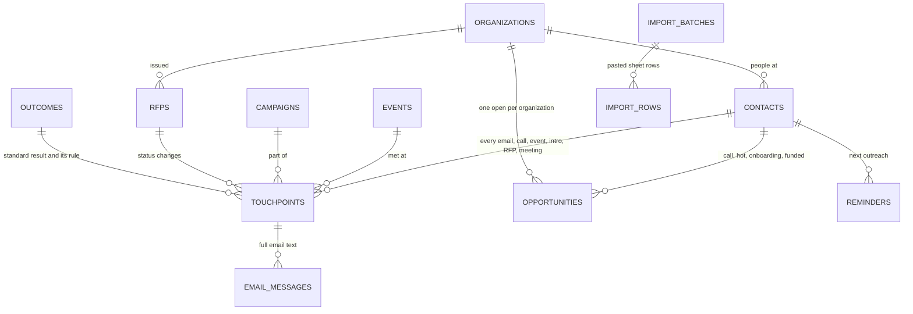

# GAARD Capital CRM: integrated database (v0.1, mock data)

One Postgres database that replaces the Google Drive patchwork: every segment, every touchpoint, the
reminders, the newsletter list, events, RFPs, and the numbers the dashboard needs. Built from the
Sep 22 meeting with John and loaded with realistic dummy data so the dashboard can be built now and
the real sheets can be imported later without changing anything.

Everything in `supabase/` has been run end to end on PostgreSQL 16: 6 migrations, the mock data,
40 automation tests (all passing) and an import demo in John's own column format.

---


https://gaard-ai-crm.github.io/First-Example-Model/

## 1. The form: where this lives and why

**Data lives in a managed Postgres database (Supabase), not in a file.** Supabase can be added from
the Vercel dashboard (Storage / Marketplace), so it is billed on the Vercel invoice GAARD already
pays and there is no new account to track. What we keep as *files* is this repository on GitHub:

| Kept as files (GitHub) | Lives in the database |
|---|---|
| `supabase/migrations/*.sql` the structure, versioned | contacts, organizations, touchpoints, emails, opportunities, reminders ... |
| `supabase/seed.sql` the mock data | the automation rules (triggers) run here on every save |
| `scripts/`, `tests/`, `data/` | the dashboard views the Next.js app reads |

Why not a file on the server (CSV / JSON / Excel / SQLite): Vercel functions do not keep files
between requests, a file cannot enforce "no duplicate emails", it cannot run the reminder rules, and
two people saving at once overwrite each other.

Why not stay on Google Sheets: the two problems John described (the master list is too big and the
Apps Script no longer catches duplicates) are exactly what a database fixes. Duplicate checks are
unique indexes; 10,000 rows is small for Postgres.

Why Supabase over plain Postgres: a spreadsheet-like Table Editor for non-technical teammates,
built-in logins, scheduled jobs (pg_cron), webhooks/Edge Functions for the email sync, and Realtime
so a reminder marked done disappears for everyone at once.

Cost: the free plan is fine while we build on dummy data. Before real client data goes in, move to
Pro (from $25/month): the free plan has no backups and pauses a project after a week without use.

## 2. How the Google Sheets fold in

| Today (Google Drive / offline) | New home |
|---|---|
| Outreach master list (2025 + 2026), Cold outreach 2026 tab | `contacts` + `organizations` (one row per person / org) and `touchpoints` (each "Date outreached" + "Outcome") |
| Affiliates, Individuals & small businesses, nonprofits | same tables, `segment_code` (see segments below) |
| Offline sourcing sheets | `import_rows` + `process_import_batch()` (section 5) |
| Wrong email tab | `contacts.email_status = 'bounced'` -> view `v_wrong_emails` |
| Next Steps tab + correspondence column M | `reminders` (next outreach) + `email_messages` / call notes -> `v_correspondence` (newest first) |
| Onboarding tab | `opportunities` (stage, dates, expected and funded AUM) |
| Events worksheet | `events` + event touchpoints -> `v_event_performance` |
| RFP workbook | `rfps` -> `v_rfp_tracker` |
| Cold-call tracking (offline) | call touchpoints + `campaigns` -> `v_cold_call_performance` |
| Newsletter list | `contacts.newsletter_status` -> `v_newsletter_list` |
| Drive dashboard + this week's reminders | dashboard views (section 6) + `v_reminders_due` |

The outreach sheet's columns map one to one:

| Sheet column | Field |
|---|---|
| Date | `contacts.sourced_on` |
| Source | `contacts.source_detail` (plus one `source_channel_code` for attribution) |
| Contact, First Name | `first_name`, `last_name` |
| Email | `contacts.email` (normalized `email_key` is unique) |
| Org, Website | `organizations.name`, `organizations.website` (matched, not retyped) |
| LinkedIn | `contacts.linkedin_url` (normalized `linkedin_key` is unique) |
| Added on LinkedIn | `contacts.linkedin_connected_on` |
| Notes | `contacts.notes` |
| Date Outreached | `touchpoints.touched_at` |
| Outcome | `touchpoints.outcome_code` (standardized) + `outcome_raw` (the original text, kept) |
| Next Steps | `touchpoints.notes` and the reminder it creates |
| AUM, Phone | `organizations.reported_aum` / `contacts.prospect_aum`, `contacts.phone` |

**Migration steps once John shares the real sheets**

1. Download each tab as CSV.
2. Outreach-style tabs: load into `import_rows` with that tab's defaults (segment, channel, `email` or
   `call`), then `select process_import_batch(<id>, p_run_automation => false);` so years of history
   do not create a flood of reminders.
3. Work the review lists: rows marked `needs_review`, and old free-text outcomes in
   `v_outcome_review_queue`. Unmatched wording becomes a new row in `outcome_aliases`; re-run.
4. Small tabs (events, RFPs, onboarding) go straight into their tables (Table Editor CSV import).
5. `select rebuild_follow_up_reminders();` gives everyone their next follow-up in one pass.
6. Every sheet row ends with a result and a pointer back (`legacy_ref`), so counts reconcile.
   Keep the sheets read-only for two weeks as the fallback.

## 3. The data model



Two ideas carry most of the design:

* **Segment and channel are separate.** Segment = what kind of client (Individuals: OCIO / Robo,
  Organizations: Nonprofit / Other, 401(k), Affiliates). Channel = how we met them (cold email, cold
  call, event, referral, RFP). Every person has one of each, so any count can be cut by both.
* **Every lead has exactly one source channel**, and every organization has at most one open
  opportunity. That is what stops the double counting John described (was it the event or the
  email?). Each opportunity also records the touch that actually booked the call
  (`converting_channel_code`), so both questions can be answered.

| Table | What it holds |
|---|---|
| `organizations` | nonprofits, foundations, small businesses, affiliates; website, state, AUM from research, flags |
| `contacts` | people; email / LinkedIn / phone, segment, state, source, flags (university, do-not-contact), newsletter |
| `touchpoints` | one row per email, dial, event conversation, introduction, RFP step, meeting, check-in, with its standardized outcome |
| `email_messages` | the actual email text in and out (filled automatically in layer 2) |
| `opportunities` | call -> hot -> onboarding -> funded (or lost), with dates and expected / funded AUM |
| `reminders` | the shared notifications list; done for one person = done for everyone |
| `events`, `campaigns`, `rfps` | cost / state / format of events, cold email and call campaigns, the RFP tracker |
| `outcomes` | the standardized outcomes **and the rule for each** (follow-up timing, newsletter, stage, do-not-contact) |
| `outcome_aliases`, `flag_rules`, `segments`, `channels` | configuration John can edit without code |
| `import_batches`, `import_rows` | the paste-in area for new prospect lists |
| `benchmarks` | industry norms for the comparison John asked for (left empty until a sourced number is entered) |

## 4. What happens automatically

| When this is saved | The database does this |
|---|---|
| any contact | normalizes email / LinkedIn / org name; blocks exact duplicates; flags `.edu` addresses (founder may know them) and anything on the do-not-contact list |
| an outreach email | starts as "No response"; follow-up reminder in 90 days (quarterly) |
| "Out of office" | follow-up the day after the return date, or in 2 weeks |
| "Not now, check back in October" | reminder on the date they gave |
| "Interested, call scheduled" | opens an opportunity, adds them to the quarterly newsletter, reminder to log the call |
| call held / hot / wants to hire us | moves the opportunity forward and stamps the date |
| "Already has an advisor" | check back in 6 months |
| unsubscribe | do-not-contact; any later email or call to them is refused |
| bounce | wrong-email list + "fix the email" reminder; fixing the email clears both |
| 3 unanswered calls in a row | stop weekly retries, back to quarterly |
| RFP status change | logged as a touch; finalist opens an opportunity, won moves to onboarding; reminder a week before each due date |
| a reply the AI classified (layer 2) | waits in `v_outcome_review_queue`; one call to `confirm_outcome()` applies it |

Daily / weekly jobs (`supabase/optional/scheduled_jobs.sql`): snoozed reminders come back; open
opportunities with no activity in 3 weeks get a reminder.

## 5. Adding prospects (the "dump in 50 cleaned rows" step)

Paste rows into `import_rows` using the sheet's own columns, then run `process_import_batch`. Each
row comes back labelled:

* `existing_contact`: already here (email or LinkedIn, any capitalization or URL format), with the last touch and outcome
* `new_contact_existing_org`: new person at an organization we know, with who was contacted there before (the "row 2500 vs row 600" hunt, done for you)
* `needs_review`: looks like a duplicate (typo in the org name, same person with a new email); a person picks "same" or "new" and runs it again
* `new_contact`, `skipped`, `error`: with the reason

`supabase/demo/import_demo.sql` runs a 31-row batch built from `data/import_demo/new_prospects_batch.csv`
(John's column headers, messy on purpose) and shows every case.

## 6. Dashboard views (what answers which question)

| John's question | View |
|---|---|
| How many emails, calls, events, responses, calls booked, onboarded, funded this quarter vs last? | `v_kpis_by_quarter` (long format: quarter, segment, state, channel, metric, value) |
| Conversion rates by segment / state / channel / quarter | `v_lead_funnel` (one row per lead) and `v_funnel_by_cohort` |
| Is it events, cold outreach or referrals that work? | `v_channel_performance` (each lead counted once) |
| What did each event cost and produce? In person vs virtual? | `v_event_performance` |
| How are the cold call campaigns doing? | `v_cold_call_performance` |
| Funded vs onboarding AUM by segment | `v_aum_by_segment`, `v_funded_aum_by_quarter` |
| Pipeline and next steps | `v_pipeline`, `v_reminders_due` |
| Master list, sortable by anything | `v_contacts`, `v_organizations` (includes the rollover suggestion) |

## 7. The mock data

Fictional people and organizations from Jan 2025 to Sep 25, 2026, simulated with the same rules the
database enforces. Emails use the reserved `.example` domain and phones use 555-01xx, so nothing can
reach a real person.

* 361 organizations, 558 contacts (Nonprofit 261, 401(k) 101, Other org 68, Robo 60, OCIO 48, Affiliate 20)
* States: Utah 370, Idaho 83, Wyoming 57, California 44, a few others
* 1,836 touchpoints: 1,078 emails, 166 cold-call dials, 180 event conversations, 54 referrals, 14 RFP steps, 196 meetings, 148 check-ins
* 1,607 email messages; 13 events (in person and virtual); 9 campaigns; 9 RFPs
* 94 opportunities: 13 call, 23 hot, 9 onboarding, 18 funded ($68.8M), 31 lost
* 1,777 reminders, 326 open (some overdue, some due this week, the rest later)
* Planted on purpose for the demo: 5 look-alike duplicates, 12 replies waiting for confirmation,
  do-not-contact cases (competitor, banking partner, founder's friend, unsubscribes), 19 university
  contacts, bounced emails, 32 organizations ready for the yearly rollover, and 65 organizations with
  more than one person (the 2025 contact who never answered and the 2026 one met at an event)

`data/mock_csv/tables/` has every table as CSV; `data/mock_csv/views/` has the master list, pipeline,
reminders and channel / event results for a quick look without a database.

## 8. The prototype front end

`app/index.html` is a working front end for this schema. It embeds a snapshot of
every table (exported from `data/mock_csv/tables`) so it runs with no server:
open the file in a browser. It reads through a data layer whose method names
mirror the views below, so pointing it at a live Supabase project means replacing
the body of each method with its query. See `app/README.md`.

## 9. Setup

**A. Create the database.** Vercel dashboard > the team that hosts the robo-advisor > Storage
(Marketplace) > Supabase > create a project, in a US West region. (Or create it on supabase.com.)

**B. Apply the structure.** Either paste the six files in `supabase/migrations/` into the Supabase SQL
Editor in order, or with the Supabase CLI from this folder:
```
supabase init                      # once; adds supabase/config.toml, keeps the migrations
supabase link --project-ref <ref>
supabase db push
```

**C. Load the mock data.** Easiest: with the connection string from Supabase (the Connect button;
use the Session pooler string if the direct one will not connect from your network)
```
psql "<connection string>" -f supabase/seed.sql
```
No psql? Paste `supabase/seed_parts/seed_part_1_of_4.sql` ... `_4_of_4.sql` into the SQL Editor in order
(each part is under 1 MB).

**D. Check it.** `psql "<connection string>" -f tests/automation_tests.sql` should print 40 PASS
(it rolls itself back, so it is safe to run any time).

**E. Logins.** Authentication > turn off public sign-ups, invite each team member, then put their
user id in `team_members.auth_user_id`. Only active team members can see anything (row-level security).

**F. Optional.** Enable pg_cron (Database > Extensions) and run `supabase/optional/scheduled_jobs.sql`.

To regenerate the mock data: `python3 scripts/generate_mock_data.py` (same data every run).

## 10. Questions for John (these change configuration rows, not the design)

1. The segment breakdown he offered to send: is "Affiliates" a client segment or referral partners? Are OCIO and Robo the right sub-levels for individuals?
2. The flag list: which domains, emails and organizations, and should each one block outreach or only warn?
3. His standardized outcome list, and the follow-up timing for each (we assumed quarterly for no response, 2 weeks for out of office, 6 months for "has an advisor").
4. Attribution: when someone met at an event later books a call from an email, should the dashboard credit the event (how we met, our default) or the email (what booked it)? Both are stored.
5. What counts as "funded" (first dollar or full transfer), and where the funded AUM number comes from.
6. The yearly rollover rule: how many attempts with no answer before trying someone else at the organization (the view uses 2+ touches, none answered, quiet for 90 days).
7. Layer 2: which inboxes (Gmail or Outlook) would be connected for email logging.

## 11. Next

* **Tuesday:** Next.js dashboard on Vercel reading the views above, plus the workflow write-up and diagram.
* **Layer 2:** inbox sync into `email_messages`, Claude suggests the outcome (`ai_suggested_outcome`), a person confirms in one click, drafted follow-ups using `follow_up_style` (standard check-in vs personalized).

References: [Supabase on the Vercel Marketplace](https://supabase.com/docs/guides/integrations/vercel-marketplace),
[Supabase pricing](https://supabase.com/pricing), [free project pausing](https://supabase.com/docs/guides/platform/free-project-pausing).
